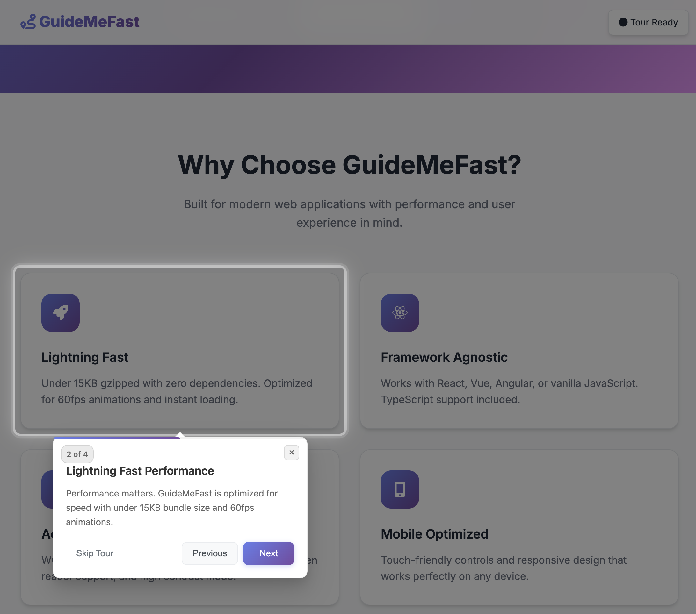

# 🚀 GuideMeFast

Beautiful, lightweight library for creating interactive guided tours in web applications. A modern, feature-rich alternative to Intro.js with full React and Material-UI support.


[](https://badge.fury.io/js/guidemefast)
[](https://opensource.org/licenses/MIT)
[](http://www.typescriptlang.org/)
[](https://github.com/eckopage/guidemefast/actions)

<p align="center">
    
</p>

## ✨ Features

- 🎨 **Beautiful UI** - Modern, clean design with smooth animations
- ⚛️ **React Support** - First-class React hooks and components
- 🎭 **Material-UI Integration** - Native Material-UI components
- 🌟 **Vanilla JS** - Works without any framework
- 📱 **Responsive** - Mobile-friendly and touch-optimized
- 🎯 **TypeScript** - Full type safety and IntelliSense
- 🎪 **Customizable** - Extensive theming and styling options
- ♿ **Accessible** - WCAG compliant with keyboard navigation
- 📦 **Lightweight** - Under 15KB gzipped
- 🚀 **Performance** - Optimized for smooth 60fps animations

## 🚀 Quick Start

### Installation

```bash
npm install guidemefast
# or
yarn add guidemefast
# or
pnpm add guidemefast
```

### React Usage

```jsx
import React from 'react';
import { useGuideMeFast } from 'guidemefast';
import 'guidemefast/dist/index.css';

function App() {
  const tourConfig = {
    steps: [
      {
        target: '#welcome-button',
        title: 'Welcome! 👋',
        content: 'This is your main dashboard. Click here to get started.',
        placement: 'bottom'
      },
      {
        target: '#profile-menu',
        title: 'Profile Settings',
        content: 'Manage your profile and preferences from here.',
        placement: 'left'
      }
    ],
    onComplete: () => {
      console.log('Tour completed!');
    }
  };

  const { startTour, TourComponent } = useGuideMeFast(tourConfig);

  return (
    <div>
      <button id="welcome-button" onClick={startTour}>
        Start Tour
      </button>
      <div id="profile-menu">Profile</div>
      {TourComponent}
    </div>
  );
}
```

### Material-UI Usage

```jsx
import { useMaterialUITour } from 'guidemefast/dist/material-ui';
import { Button } from '@mui/material';

function App() {
  const { startTour, TourComponent } = useMaterialUITour(tourConfig, 'dialog');
  
  return (
    <div>
      <Button onClick={startTour}>Start Tour</Button>
      {TourComponent}
    </div>
  );
}
```

### Vanilla JavaScript

```html
<!DOCTYPE html>
<html>
<head>
  <link rel="stylesheet" href="https://unpkg.com/guidemefast@latest/dist/index.css">
</head>
<body>
  <button id="start-tour">Start Tour</button>
  <div id="feature-1">Feature 1</div>
  <div id="feature-2">Feature 2</div>

  <script src="https://unpkg.com/guidemefast@latest/dist/guidemefast.min.js"></script>
  <script>
    const tour = new GuideMeFast({
      steps: [
        {
          target: '#feature-1',
          title: 'Amazing Feature',
          content: 'This feature will help you be more productive!',
          placement: 'right'
        },
        {
          target: '#feature-2',
          title: 'Another Feature',
          content: 'And this one is even cooler!',
          placement: 'top'
        }
      ]
    });

    document.getElementById('start-tour').addEventListener('click', () => {
      tour.start();
    });
  </script>
</body>
</html>
```

## 📖 API Reference

### TourConfig Interface

```typescript
interface TourConfig {
  steps: TourStep[];                     // Array of tour steps
  onComplete?: () => void;               // Called when tour completes
  onSkip?: () => void;                   // Called when tour is skipped
  theme?: 'light' | 'dark' | 'material'; // Visual theme
  showProgress?: boolean;                // Show progress bar (default: true)
  showStepNumbers?: boolean;             // Show step counter (default: true)
  backdropOpacity?: number;              // Backdrop transparency 0-1 (default: 0.7)
  highlightPadding?: number;             // Highlight padding in pixels (default: 8)
  scrollBehavior?: 'smooth' | 'auto';    // Scroll animation (default: 'smooth')
  zIndex?: number;                       // CSS z-index (default: 9999)
  closeOnEscape?: boolean;               // Close on Escape key (default: true)
  closeOnClickOutside?: boolean;         // Close on backdrop click (default: false)
  customStyles?: {                       // Custom CSS styles
    tooltip?: React.CSSProperties;
    backdrop?: React.CSSProperties;
    highlight?: React.CSSProperties;
  };
}
```

### TourStep Interface

```typescript
interface TourStep {
  target: string;                        // CSS selector
  title: string;                         // Step title
  content: string;                       // Step content (HTML supported)
  placement?: 'top' | 'bottom' | 'left' | 'right'; // Tooltip position (default: 'top')
  showSkip?: boolean;                    // Show skip button (default: true)
  showPrev?: boolean;                    // Show previous button (default: true)
  showNext?: boolean;                    // Show next button (default: true)
  onNext?: () => void | Promise<void>;   // Custom next handler
  onPrev?: () => void | Promise<void>;   // Custom previous handler
  onSkip?: () => void | Promise<void>;   // Custom skip handler
  customClass?: string;                  // Custom CSS class
  offset?: { x: number; y: number };     // Position offset
}
```

## 🎨 Theming

### Built-in Themes

- **Light** (default) - Clean, bright theme
- **Dark** - Dark mode compatible
- **Material** - Material Design inspired

### Custom Styling

```css
.guidemefast-tooltip {
  --tooltip-bg: #ffffff;
  --tooltip-border: #e2e8f0;
  --tooltip-shadow: 0 10px 25px rgba(0, 0, 0, 0.1);
  --primary-color: #3b82f6;
  --text-color: #1f2937;
}

.guidemefast-theme-custom .guidemefast-tooltip {
  background: var(--tooltip-bg);
  border: 1px solid var(--tooltip-border);
  box-shadow: var(--tooltip-shadow);
}
```

### Runtime Styling

```javascript
const customConfig = {
  steps: [...],
  customStyles: {
    tooltip: {
      background: 'linear-gradient(135deg, #667eea 0%, #764ba2 100%)',
      color: 'white',
      borderRadius: '16px'
    },
    highlight: {
      boxShadow: '0 0 0 4px rgba(102, 126, 234, 0.5)'
    }
  }
};
```

## 🔧 Advanced Usage

### Async Step Handlers

```javascript
const asyncTourConfig = {
  steps: [
    {
      target: '#async-feature',
      title: 'Loading Data...',
      content: 'We\'ll load some data before proceeding.',
      onNext: async () => {
        const data = await fetchUserData();
        updateUI(data);
      }
    }
  ]
};
```

### Conditional Steps

```javascript
const conditionalTour = {
  steps: [
    {
      target: '#premium-feature',
      title: 'Premium Feature',
      content: 'This feature is available for premium users.',
      onNext: async () => {
        if (!user.isPremium) {
          // Handle non-premium users
          showUpgradePrompt();
          return;
        }
        // Continue with premium flow
      }
    }
  ]
};
```

### Error Handling

```javascript
const robustConfig = {
  steps: [
    {
      target: '#may-not-exist',
      title: 'Robust Step',
      content: 'This step handles missing elements gracefully.',
      onNext: async () => {
        try {
          await riskyOperation();
        } catch (error) {
          console.error('Step failed:', error);
          // Handle error gracefully
        }
      }
    }
  ]
};
```

## 🧪 Testing

GuideMeFast is fully testable with standard testing frameworks:

```javascript
// Jest + React Testing Library example
import { render, screen, fireEvent, waitFor } from '@testing-library/react';
import { useGuideMeFast } from 'guidemefast';

test('tour starts and shows first step', async () => {
  const TestComponent = () => {
    const { startTour, TourComponent } = useGuideMeFast({
      steps: [
        {
          target: '#test-element',
          title: 'Test Step',
          content: 'Test content'
        }
      ]
    });

    return (
      <div>
        <button onClick={startTour}>Start</button>
        <div id="test-element">Target</div>
        {TourComponent}
      </div>
    );
  };

  render(<TestComponent />);
  
  fireEvent.click(screen.getByText('Start'));
  
  await waitFor(() => {
    expect(screen.getByText('Test Step')).toBeInTheDocument();
    expect(screen.getByText('Test content')).toBeInTheDocument();
  });
});
```

## 📱 Mobile Optimization

GuideMeFast automatically adapts to mobile devices:

- Touch-friendly button sizes
- Responsive tooltip positioning
- Improved readability on small screens
- Optimized for mobile interactions

## ♿ Accessibility

- Full keyboard navigation support
- ARIA labels and roles
- Screen reader compatibility
- High contrast mode support
- Focus management
- Reduced motion respect

## 🚀 Performance

- Lightweight bundle (< 15KB gzipped)
- Tree-shakeable imports
- Optimized for 60fps animations
- Minimal DOM manipulation
- Efficient event handling

## 🔌 Framework Integrations

### Next.js

```javascript
// pages/_app.js
import 'guidemefast/dist/index.css';

// components/Tour.js
import dynamic from 'next/dynamic';

const GuideMeFast = dynamic(
  () => import('guidemefast').then(mod => mod.useGuideMeFast),
  { ssr: false }
);
```

### Vue.js

```vue
<template>
  <div>
    <button @click="startTour">Start Tour</button>
  </div>
</template>

<script>
import 'guidemefast/dist/index.css';

export default {
  async mounted() {
    const { GuideMeFast } = await import('guidemefast/dist/vanilla');
    this.tour = new GuideMeFast({ steps: [...] });
  },
  methods: {
    startTour() {
      this.tour.start();
    }
  }
}
</script>
```

### Angular

```typescript
// tour.service.ts
import { Injectable } from '@angular/core';

@Injectable({ providedIn: 'root' })
export class TourService {
  private tour: any;
  
  async initTour() {
    const { GuideMeFast } = await import('guidemefast/dist/vanilla');
    this.tour = new GuideMeFast({ steps: [...] });
  }
  
  start() {
    this.tour?.start();
  }
}
```

## 🛠 Development

### Development Setup

```bash
git clone https://github.com/eckopage/guidemefast.git
cd guidemefast
npm install
npm run dev
```

### Building

```bash
npm run build          # Build all versions
npm run build:watch    # Build with file watching
npm run type-check     # TypeScript type checking
npm run lint           # ESLint checking
npm run test           # Run tests
```

## 📊 Bundle Analysis

```bash
# Analyze bundle size
npm run build
npx bundlephobia guidemefast
```

## 🔄 Automatic Releases

This project uses automated semantic versioning:

- `feat:` commits trigger minor releases
- `fix:` commits trigger patch releases
- `feat!:` or `BREAKING CHANGE:` trigger major releases

## 📄 License

MIT © [Erwin Czerniawski](https://github.com/eckopage)

## 🤝 Contributing

We welcome contributions! Please see our [Contributing Guide](CONTRIBUTING.md) for details.

### Development Process

1. Fork the repository
2. Create a feature branch: `git checkout -b feature/amazing-feature`
3. Make changes and add tests
4. Run quality checks: `npm run lint && npm test`
5. Commit using conventional commits: `git commit -m "feat: add amazing feature"`
6. Push and create a Pull Request

## 📞 Support & Resources

- 🐛 [Issue Tracker](https://github.com/eckopage/guidemefast/issues) - Bug reports and feature requests
- 💬 [Discussions](https://github.com/eckopage/guidemefast/discussions) - Questions and community
- 📧 [Email Support](mailto:erwinczerniawski@gmail.com) - Direct support
- 📚 [NPM Package](https://www.npmjs.com/package/guidemefast) - Package info and stats

## 🗺 Roadmap

- [ ] Vue.js native components
- [ ] Angular native components
- [ ] Svelte support
- [ ] Visual tour builder
- [ ] Analytics integration
- [ ] A/B testing support
- [ ] Multi-language support
- [ ] Advanced animations
- [ ] Keyboard shortcuts
- [ ] Tour recording/playback

## 🎯 Alternatives

If GuideMeFast doe# 🚀 GuideMeFast

[](https://badge.fury.io/js/guidemefast)
[](https://opensource.org/licenses/MIT)
[](http://www.typescriptlang.org/)

Beautiful, lightweight library for creating interactive guided tours in web applications. A modern, feature-rich alternative to Intro.js with full React and Material-UI support.

## ✨ Features

- 🎨 **Beautiful UI** - Modern, clean design with smooth animations
- ⚛️ **React Support** - First-class React hooks and components
- 🎭 **Material-UI Integration** - Native Material-UI components
- 🌟 **Vanilla JS** - Works without any framework
- 📱 **Responsive** - Mobile-friendly and touch-optimized
- 🎯 **TypeScript** - Full type safety and IntelliSense
- 🎪 **Customizable** - Extensive theming and styling options
- ♿  **Accessible** - WCAG compliant with keyboard navigation
- 📦 **Lightweight** - Under 15KB gzipped
- 🚀 **Performance** - Optimized for smooth 60fps animations

## 🚀 Quick Start

### Installation

```bash
npm install guidemefast
```

### React Usage

```jsx
import React from 'react';
import { useGuideMeFast } from 'guidemefast';
import 'guidemefast/dist/index.css';

function App() {
  const tourConfig = {
    steps: [
      {
        target: '#welcome-button',
        title: 'Welcome! 👋',
        content: 'This is your main dashboard. Click here to get started.',
        placement: 'bottom'
      },
      {
        target: '#profile-menu',
        title: 'Profile Settings',
        content: 'Manage your profile and preferences from here.',
        placement: 'left'
      }
    ],
    onComplete: () => {
      console.log('Tour completed!');
    }
  };

  const { startTour, TourComponent } = useGuideMeFast(tourConfig);

  return (
    <div>
      <button id="welcome-button" onClick={startTour}>
        Start Tour
      </button>
      <div id="profile-menu">Profile</div>
      {TourComponent}
    </div>
  );
}
```

### Material-UI Usage

```jsx
import { useMaterialUITour } from 'guidemefast/dist/material-ui';

function App() {
  const { startTour, TourComponent } = useMaterialUITour(tourConfig, 'dialog');
  
  return (
    <div>
      <Button onClick={startTour}>Start Tour</Button>
      {TourComponent}
    </div>
  );
}
```

### Vanilla JavaScript

```html
<!DOCTYPE html>
<html>
<head>
  <link rel="stylesheet" href="https://unpkg.com/guidemefast@latest/dist/index.css">
</head>
<body>
  <button id="start-tour">Start Tour</button>
  <div id="feature-1">Feature 1</div>
  <div id="feature-2">Feature 2</div>

  <script src="https://unpkg.com/guidemefast@latest/dist/guidemefast.min.js"></script>
  <script>
    const tour = new GuideMeFast({
      steps: [
        {
          target: '#feature-1',
          title: 'Amazing Feature',
          content: 'This feature will help you be more productive!',
          placement: 'right'
        },
        {
          target: '#feature-2',
          title: 'Another Feature',
          content: 'And this one is even cooler!',
          placement: 'top'
        }
      ]
    });

    document.getElementById('start-tour').addEventListener('click', () => {
      tour.start();
    });
  </script>
</body>
</html>
```

### CDN Auto-initialization

```html
<div data-guidemefast-auto 
     data-guidemefast-trigger="#start-button"
     data-guidemefast-config='{"steps": [...]}'>
</div>
```

## 📖 API Reference

### TourConfig Interface

```typescript
interface TourConfig {
  steps: TourStep[];                     // Array of tour steps
  onComplete?: () => void;               // Called when tour completes
  onSkip?: () => void;                   // Called when tour is skipped
  theme?: 'light' | 'dark' | 'material'; // Visual theme
  showProgress?: boolean;                // Show progress bar
  showStepNumbers?: boolean;             // Show step counter
  backdropOpacity?: number;              // Backdrop transparency (0-1)
  highlightPadding?: number;             // Highlight padding in pixels
  scrollBehavior?: 'smooth' | 'auto';    // Scroll animation
  zIndex?: number;                       // CSS z-index
  closeOnEscape?: boolean;               // Close on Escape key
  closeOnClickOutside?: boolean;         // Close on backdrop click
  customStyles?: {                       // Custom CSS styles
    tooltip?: React.CSSProperties;
    backdrop?: React.CSSProperties;
    highlight?: React.CSSProperties;
  };
}
```

### TourStep Interface

```typescript
interface TourStep {
  target: string;                        // CSS selector
  title: string;                         // Step title
  content: string;                       // Step content (HTML supported)
  placement?: 'top' | 'bottom' | 'left' | 'right'; // Tooltip position
  showSkip?: boolean;                    // Show skip button
  showPrev?: boolean;                    // Show previous button
  showNext?: boolean;                    // Show next button
  onNext?: () => void | Promise<void>;   // Custom next handler
  onPrev?: () => void | Promise<void>;   // Custom previous handler
  onSkip?: () => void | Promise<void>;   // Custom skip handler
  customClass?: string;                  // Custom CSS class
  offset?: { x: number; y: number };     // Position offset
}
```

## 🎨 Theming

### Built-in Themes

- **Light** (default) - Clean, bright theme
- **Dark** - Dark mode compatible
- **Material** - Material Design inspired

### Custom Styling

```css
.guidemefast-tooltip {
  --tooltip-bg: #ffffff;
  --tooltip-border: #e2e8f0;
  --tooltip-shadow: 0 10px 25px rgba(0, 0, 0, 0.1);
  --primary-color: #3b82f6;
  --text-color: #1f2937;
}

.guidemefast-theme-custom .guidemefast-tooltip {
  background: var(--tooltip-bg);
  border: 1px solid var(--tooltip-border);
  box-shadow: var(--tooltip-shadow);
}
```

### Runtime Styling

```javascript
const customConfig = {
  steps: [...],
  customStyles: {
    tooltip: {
      background: 'linear-gradient(135deg, #667eea 0%, #764ba2 100%)',
      color: 'white',
      borderRadius: '16px'
    },
    highlight: {
      boxShadow: '0 0 0 4px rgba(102, 126, 234, 0.5)'
    }
  }
};
```

## 🔧 Advanced Usage

### Async Step Handlers

```javascript
const asyncTourConfig = {
  steps: [
    {
      target: '#async-feature',
      title: 'Loading Data...',
      content: 'We\'ll load some data before proceeding.',
      onNext: async () => {
        const data = await fetchUserData();
        updateUI(data);
      }
    }
  ]
};
```

### Dynamic Step Content

```javascript
const dynamicTour = {
  steps: [
    {
      target: '#user-profile',
      title: () => `Welcome, ${user.name}!`,
      content: () => `You have ${user.notifications} new notifications.`,
    }
  ]
};
```

### Conditional Steps

```javascript
const conditionalTour = {
  steps: [
    {
      target: '#premium-feature',
      title: 'Premium Feature',
      content: 'This feature is available for premium users.',
      onNext: () => {
        if (!user.isPremium) {
          // Skip to different step or show upgrade prompt
          tour.goToStep(5);
        }
      }
    }
  ]
};
```

## 🧪 Testing

GuideMeFast is fully testable with standard testing frameworks:

```javascript
// Jest example
import { render, screen, fireEvent } from '@testing-library/react';
import { useGuideMeFast } from 'guidemefast';

test('tour starts and shows first step', () => {
  const TestComponent = () => {
    const { startTour, TourComponent } = useGuideMeFast({
      steps: [
        {
          target: '#test-element',
          title: 'Test Step',
          content: 'Test content'
        }
      ]
    });

    return (
      <div>
        <button onClick={startTour}>Start</button>
        <div id="test-element">Target</div>
        {TourComponent}
      </div>
    );
  };

  render(<TestComponent />);
  
  fireEvent.click(screen.getByText('Start'));
  
  expect(screen.getByText('Test Step')).toBeInTheDocument();
  expect(screen.getByText('Test content')).toBeInTheDocument();
});
```

## 📱 Mobile Optimization

GuideMeFast automatically adapts to mobile devices:

- Touch-friendly button sizes
- Responsive tooltip positioning
- Swipe gesture support
- Improved readability on small screens

```css
@media (max-width: 768px) {
  .guidemefast-tooltip {
    max-width: calc(100vw - 40px);
    margin: 20px;
  }
}
```

## ♿ Accessibility

- Full keyboard navigation support
- ARIA labels and roles
- Screen reader compatibility
- High contrast mode support
- Focus management
- Reduced motion respect

```javascript
// Accessibility-focused configuration
const accessibleConfig = {
  steps: [...],
  closeOnEscape: true,
  customStyles: {
    tooltip: {
      fontSize: '16px',
      lineHeight: '1.6'
    }
  }
};
```

## 🚀 Performance Tips

1. **Lazy Loading**: Import only what you need
2. **Bundle Splitting**: Separate tour code from main bundle
3. **Preload Critical Steps**: Cache important tour data
4. **Optimize Images**: Use optimized images in tour content
5. **Debounce Resize**: Tour automatically handles window resize

```javascript
// Code splitting example
const loadTour = async () => {
  const { useGuideMeFast } = await import('guidemefast');
  return useGuideMeFast(config);
};
```

## 🔌 Integrations

### Next.js

```javascript
// pages/_app.js
import 'guidemefast/dist/index.css';

// components/Tour.js
import dynamic from 'next/dynamic';

const GuideMeFast = dynamic(
  () => import('guidemefast').then(mod => mod.GuideMeFast),
  { ssr: false }
);
```

### Vue.js

```javascript
// Vue 3 composition API
import { ref } from 'vue';
import { GuideMeFastVanilla } from 'guidemefast';

export default {
  setup() {
    const tour = new GuideMeFastVanilla(config);
    
    return {
      startTour: () => tour.start(),
      stopTour: () => tour.stop()
    };
  }
};
```

### Angular

```typescript
// tour.service.ts
import { Injectable } from '@angular/core';
import { GuideMeFastVanilla } from 'guidemefast';

@Injectable({
  providedIn: 'root'
})
export class TourService {
  private tour: GuideMeFastVanilla;
  
  constructor() {
    this.tour = new GuideMeFastVanilla(config);
  }
  
  start() {
    this.tour.start();
  }
}
```

## 🛠 Development & Contributing

### Development Setup

```bash
git clone https://github.com/eckopage/guidemefast.git
cd guidemefast
npm install
npm run dev
```

### Building

```bash
npm run build          # Build all versions
npm run build:watch    # Build with file watching
npm run type-check     # TypeScript type checking
```

### Testing

```bash
npm test               # Run tests
npm run test:watch     # Run tests in watch mode
npm run test:coverage  # Generate coverage report
```

### Publishing

```bash
npm run prepare        # Pre-publish checks
npm publish            # Publish to npm
```

## 📄 License

MIT © [Erwin Czerniawski](https://github.com/eckopage)

## 🤝 Contributing

We welcome contributions! Please see our [Contributing Guide](CONTRIBUTING.md) for details.

## 📞 Support

- 📚 [Documentation](https://guidemefast.dev)
- 🐛 [Issue Tracker](https://github.com/eckopage/guidemefast/issues)
- 💬 [Discussions](https://github.com/eckopage/guidemefast/discussions)
- 📧 [Email Support](mailto:erwinczerniawski@gmail.com)

## 🗺 Roadmap

- [ ] Vue.js native components
- [ ] Angular native components
- [ ] Svelte support
- [ ] Visual tour builder
- [ ] Analytics integration
- [ ] A/B testing support
- [ ] Multi-language support
- [ ] Advanced animations

---

**Made with ❤️ by developers, for developers.**

⭐ Star us on GitHub if GuideMeFast helps your project!